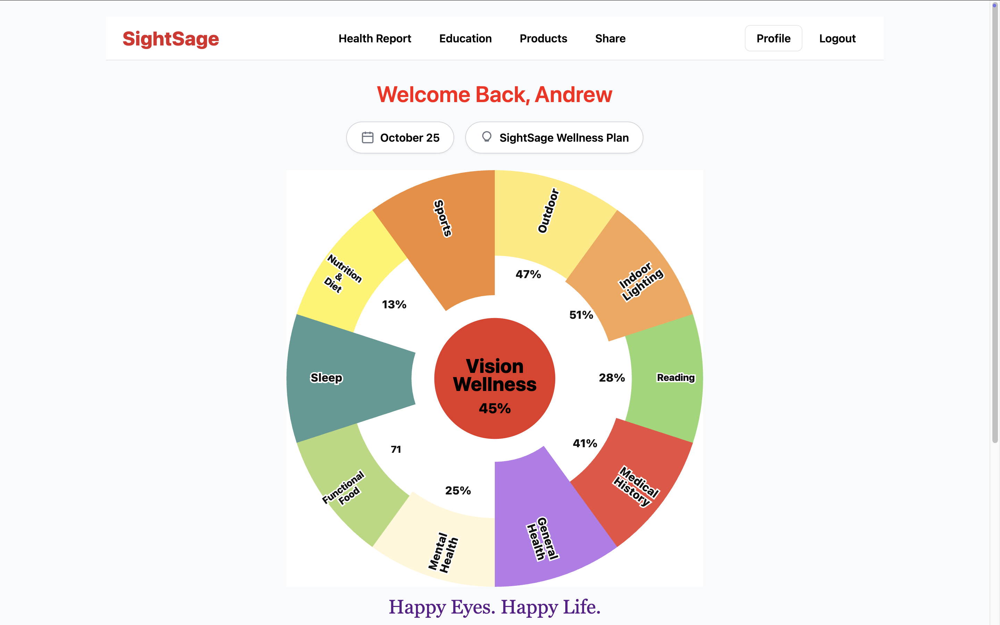
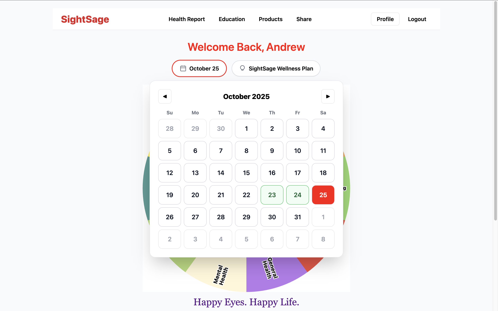
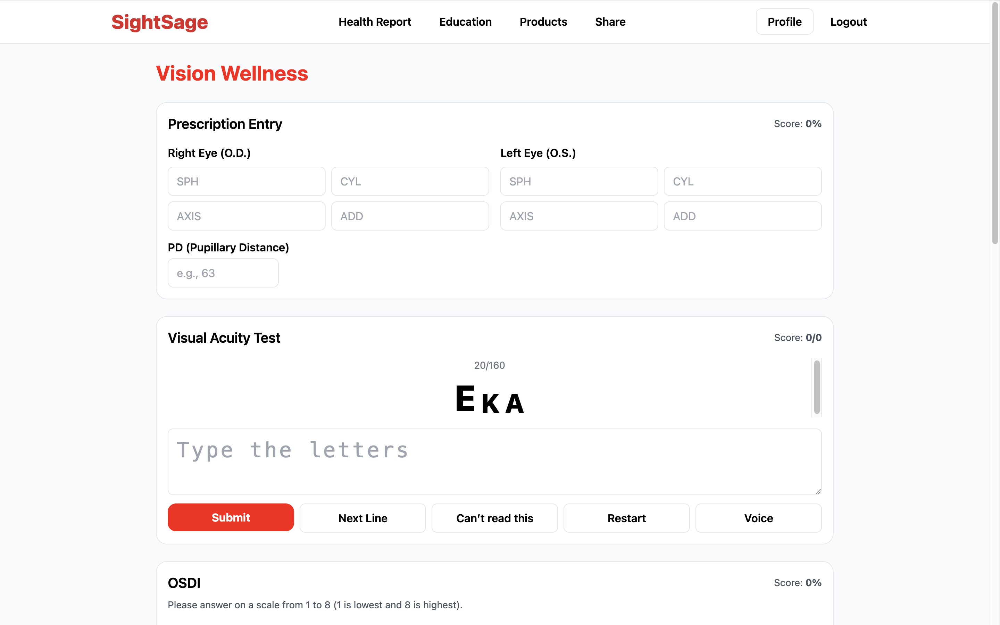
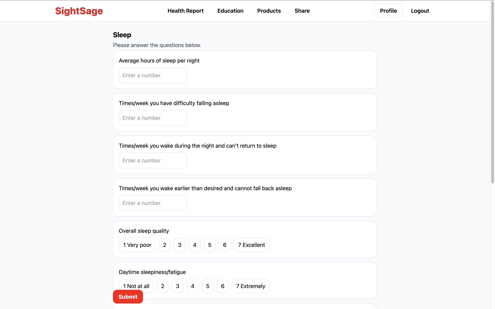
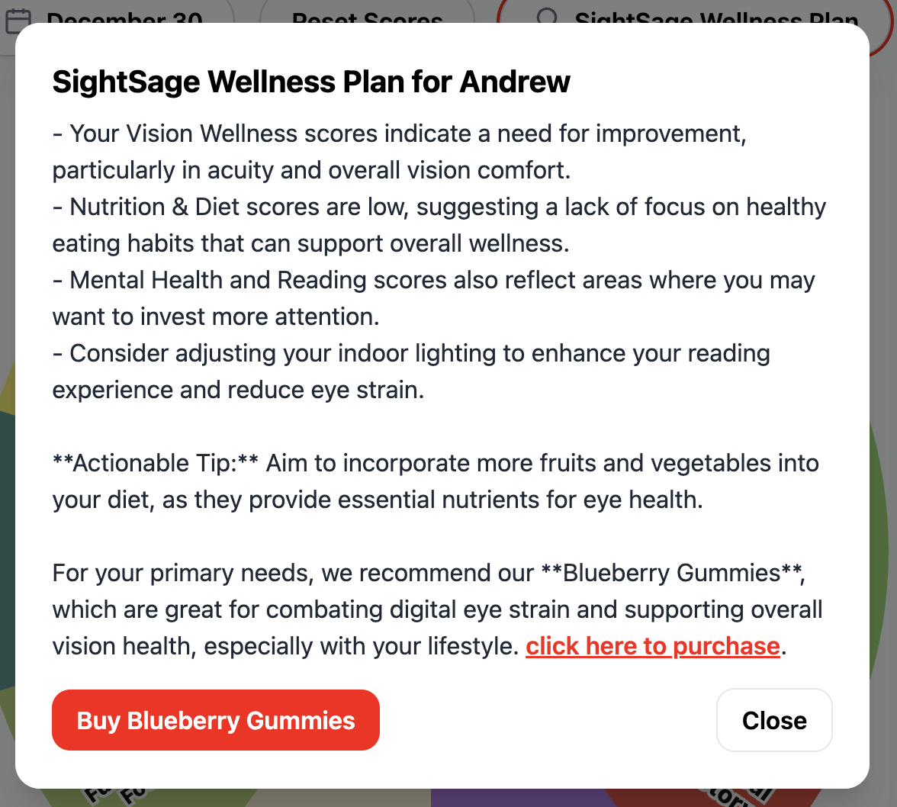

# SightSage Health Management

A wellness tracking web app that turns daily self-reported health data into clear, actionable guidance. The app generates a personalized **Wellness Plan** using the **OpenAI (ChatGPT) API** and surfaces relevant educational content using the **YouTube Data API**.

## Access / Demo
This app is currently hosted in an internal environment:

- Internal URL: [https://sightsage.com/app](https://sightsage.com/app)

If you don’t have access to the internal environment, the screenshots below show the key flows.

## Screenshots







## What it does
- Tracks daily wellness inputs and scores across health topics using questionnaires.
- **Interactive wellness wheel dashboard**: click a slice to open a guided questionnaire for that category.
- **Calendar-based history**: revisit previous days to view past scores and trends.
- **Eye Test module**: built-in vision check to capture eye-health signals and support the overall wellness score.
- **Wellness Plan / Smart Tip**: personalized guidance generated via OpenAI (ChatGPT) based on user inputs and history
- **Education Search**: finds curated videos via the YouTube Data API
- Visual dashboard with drill-down navigation and health report charts displaying scores over time. 
- User authentication + saved history (Supabase)

## Tech Stack
- **Frontend:** React + TypeScript + Tailwind CSS
- **Backend:** Serverless Functions (Netlify Functions / Node)
- **Database/Auth:** Supabase (Auth + Postgres)
- **AI:** OpenAI API (ChatGPT)
- **Video:** YouTube Data API v3

## How it works 
- The **frontend** collects user inputs and displays wellness trends.
- Calls that require secrets (OpenAI / YouTube API keys) run **server-side** via serverless functions.
- User accounts and stored history live in **Supabase**.

## Setup (Local Development)

### Prerequisites
- Node.js (LTS recommended)
- OpenAI API key + YouTube Data API key
- Supabase project (URL + anon key)

### Environment variables
Create a `.env` file in the project root:

- `OPENAI_API_KEY`
- `GOOGLE_YT_API_KEY`
- `SUPABASE_URL`
- `SUPABASE_ANON_KEY`

> If your serverless functions use Supabase admin access, keep this server-only:
> - `SUPABASE_SERVICE_ROLE_KEY` (**never** expose to the client)
### Install & run
```bash
npm install
npm run dev

Netlify functions for server-side API calls:
netlify dev

```md
## Security
- API keys are never exposed to the client
- OpenAI/YouTube requests run server-side via serverless functions

## Author
**Andrew Daniel Singari**
- LinkedIn: https://www.linkedin.com/in/andrewdanielsingari?utm_source=share&utm_campaign=share_via&utm_content=profile&utm_medium=ios_app

